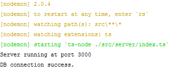

# Node-Express-Orm-TypeScript-Template
Simple Node.js, Express, TypeScript, Sequelize Orm template with proper documentation to get started.

Goal of this repository is to build simple well documented TypeScript based Node.JS Express api 
which is easy and fast base for agile api development when time is limited. It's <b>work in progress</b>.


--------------------
Table of contents
=================
* [Sources](#sources)
* [Version Notes](#version-notes)
* [Installation](#installation)
    * [Package setup](#package-setup)
    * [Environment settings](#environment-settings)
    * [Start dev server](#start-dev-server)
* [Documentation](#documentation)
    * [Title1](#title1)
    * [Title2](#title2)
--------------------

Sources
============
I originally used api generator from this [source](https://github.com/ChechaValerii/node-typescript-mongodb).
I found this initially complicated to get started with if no proper experience with TypeScript API's.

Version notes
============
At the time of writing this TypeScript used was on version: <b>3.9.5</b>


Installation
============

Package setup
-----

Run following commands one at the time, once.  
Lines have comments explaining basics what these packages do.  
`npm -g` means global installation basically working from CLI, it's same as giving `--global` flag.

```bash
npm install -g nodemon          # Needed to listen for changes when developing
npm install -g ts-node          # Allows you to run TypeScript in Node. js directly, without having to run the files through the TypeScript compiler (tsc), first
npm install -g typescript       # TypeScript is a language for application-scale JavaScript, it's language you are using for development here.
npm install                     # Installs all dev/dependencies from packages.json file.
```

Environment settings 
-----
Next create `.env` file using `.env_template` contents as example.  
Place this file in same folder as template file already is.

Start dev server
-----
Run following command

```bash
nodemon
```

Result should look like this:
  


Open web browser and navigate to `http://localhost:3000/` depending of port you set at `.env` file.


Documentation
============


--------------------
Todo: npm install express @types/express


Todo: explain about  dev dependencies

Todo: https://github.com/helmetjs/helmet
explain helmet