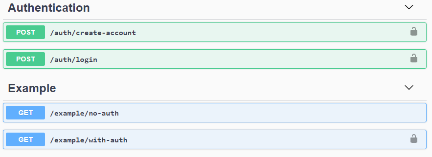

# Node-Express-Orm-TypeScript-Template
Simple Node.js, Express, TypeScript, Sequelize Orm template with proper documentation to get started.

Goal of this repository is to build simple well documented TypeScript based Node.JS Express api 
which is easy and fast base for agile api development when time is limited. It's <b>work in progress</b>.


--------------------
Table of contents
=================
* [Sources](#sources)
* [Version Notes](#version-notes)
* [Installation](#installation)
    * [Package setup](#package-setup)
    * [Environment settings](#environment-settings)
    * [Start dev server](#start-dev-server)
* [Documentation](#documentation)
    * [Beginning](#beginning)
    * [Adding new route](#adding-new-route)
--------------------

Sources
============
I originally used api generator from this [source](https://github.com/ChechaValerii/node-typescript-mongodb).
I found this initially complicated to get started with if no proper experience with TypeScript API's.

Version notes
============
At the time of writing this TypeScript used was on version: <b>3.9.5</b>


Installation
============

Package setup
-----

Run following commands one at the time, once.  
Lines have comments explaining basics what these packages do.  
`npm -g` means global installation basically working from CLI, it's same as giving `--global` flag.

```bash
npm install -g nodemon          # Needed to listen for changes when developing
npm install -g ts-node          # Allows you to run TypeScript in Node. js directly, without having to run the files through the TypeScript compiler (tsc), first
npm install -g typescript       # TypeScript is a language for application-scale JavaScript, it's language you are using for development here.
npm install                     # Installs all dev/dependencies from packages.json file.
```

Environment settings 
-----
Next create `.env` file using `.env_template` contents as example.  
Place this file in same folder as template file already is.

Start dev server
-----
Run following command

```bash
nodemon
```

Result should look like this:
  


Open web browser and navigate to `http://localhost:3000/` depending of port you set at `.env` file.


Documentation
============

Beginning
-----

See `nodemon.json` file at the root of this project. Inside there you find reference to file `/src/server/index.ts`

Server `index.ts` is where all begins. It works with following components:

<b>index.ts</b>
```text
eventHandlers          # Functions which are triggered on specific events like on error event.
```

<b>server.ts</b>
```text
express             # creates express app
middleware          # load middleware, this is explained more later
routes              # This is where your routes like /book/get are described and then logic is behind this
process variables   # At server.ts app get's set it's process variables, loaded from .env file or set as default if not specified
```

<b>middleware.ts</b>  
Middleware has following functions:
```text
bodyparser          # Parse incoming request bodies in a middleware before your handlers, available under the req.body property.
cookieParser        # Parse Cookie header and populate req.cookies with an object keyed by the cookie names.
compression         # Attempt to compress response bodies for all request that traverse through the middleware, based on the given options.
helmet              # Helps you secure your Express apps by setting various HTTP headers.
cors                # Connect/Express middleware that can be used to enable CORS with various options.
sendHttpErrorModule # Custom request filter to send error code on non valid request. 
logRequestPaths     # Live logging requested paths, can be disabled since console logging is synchronous, meaning that it affects performance.
```

Adding new route
-----
